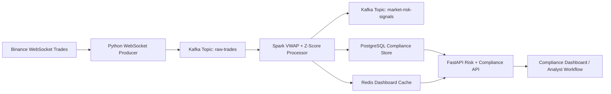

# Crypto Risk + AML Compliance Agent

Enterprise-style crypto market surveillance platform for detecting abnormal trading behavior and supporting AML compliance workflows.

This project is built as a Forward Deployed Engineering portfolio system: it frames a real customer problem, implements a streaming architecture, exposes operational APIs, and documents the path from local prototype to production deployment.

## Business Problem

Financial institutions, exchanges, and compliance teams need to monitor high-volume crypto markets continuously. Suspicious activity can appear as abnormal price movement, unusual volume, wash-trading patterns, or trades that exceed regulatory review thresholds.

This platform demonstrates how a bank or exchange could ingest live market data, compute risk signals, store audit evidence, and expose compliance-ready APIs for investigation.

## Architecture



## Core Components

| Component | Purpose |
| --- | --- |
| `producer/` | Connects to Binance live trade streams and publishes normalized trade events to Kafka. |
| `spark_jobs/` | Computes rolling VWAP, price z-scores, anomaly flags, and persistence outputs. |
| `api/` | Exposes health, risk, dashboard, compliance alert, and audit endpoints through FastAPI. |
| `infrastructure/postgres/` | Defines the local compliance schema for raw trades, risk signals, alerts, and audit logs. |
| `docker-compose.yml` | Runs Kafka, Kafka UI, Postgres, Redis, producer, Spark, and API locally. |
| `docs/screenshots/` | Contains evidence of the platform running for portfolio review. |

## Quick Start

Create a local environment file:

```bash
cp .env.example .env
```

Start the platform:

```bash
docker compose up --build
```

Open the local services:

| Service | URL |
| --- | --- |
| FastAPI Swagger UI | http://localhost:8000/docs |
| API health check | http://localhost:8000/health |
| Kafka UI | http://localhost:8080 |
| Postgres | localhost:5432 |
| Redis | localhost:6379 |

Run the test suite:

```bash
python -m pip install -r requirements-dev.txt
PYTHONPATH="$PWD:$PWD/api" pytest -q
```

## API Endpoints

| Endpoint | Description |
| --- | --- |
| `GET /health` | Service health status. |
| `GET /risk/dashboard` | Low-latency dashboard summary from Redis. |
| `GET /risk/signals` | Historical risk signals from PostgreSQL. |
| `GET /risk/vwap/{symbol}` | Latest VWAP and z-score for a symbol. |
| `GET /compliance/alerts` | AML alerts for compliance officer review. |
| `GET /compliance/audit` | Immutable audit trail for compliance actions. |
| `GET /compliance/summary` | Executive compliance summary. |

## Security Notes

The local stack uses development defaults so reviewers can run it quickly. Production deployments should replace them with managed secrets, private networking, authenticated APIs, TLS, and least-privilege access controls.

Implemented hardening:

- API CORS origins are configured with `ALLOWED_ORIGINS`.
- Containers run application processes as non-root users where practical.
- Secrets are represented in `.env.example` and `.env` is ignored by Git.
- Database access uses parameterized SQL queries.

## Production Roadmap

1. Add authentication and role-based authorization for analyst, investigator, and admin workflows.
2. Add Kubernetes manifests or Helm charts for API, producer, Spark, Kafka dependencies, Redis, and Postgres.
3. Add Terraform for AWS EKS, MSK or self-managed Kafka, RDS Postgres, ElastiCache Redis, IAM, networking, and observability.
4. Add Prometheus metrics, Grafana dashboards, structured logs, and alerting.
5. Add dead-letter topics and replay tooling for failed trade events.
6. Add integration tests that exercise Kafka, Spark, Postgres, Redis, and API behavior together.
7. Add compliance workflow endpoints for alert assignment, escalation, STR filing, and audit evidence export.

## Engineering Trade-Offs

- Docker Compose keeps the system easy to run locally, but production should use Kubernetes and managed cloud services.
- Spark is appropriate for scalable stream processing, but a smaller deployment could use Kafka Streams or Flink depending on latency and operational requirements.
- Redis improves dashboard latency, but Postgres remains the system of record for compliance evidence.
- VWAP and z-score are explainable first-pass signals; production AML systems should add entity resolution, wallet graph features, behavioral history, and model monitoring.

## Interview Talking Points

- How Kafka partition keys preserve per-symbol ordering for time-series calculations.
- Why compliance systems need audit logs, replayability, and dead-letter handling.
- How VWAP differs from simple moving averages in market surveillance.
- Where exactly-once processing is difficult in Spark/Kafka/Postgres pipelines.
- How you would move this from local Compose to production EKS with Terraform and GitHub Actions.
